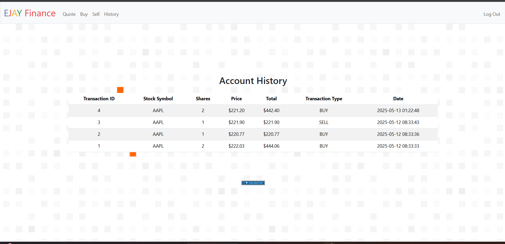

# Finance App - README

## Project Description

This is a web-based finance application designed to simulate stock market transactions and portfolio management. Users can register, log in, look up stock quotes, buy and sell stocks, view their portfolio, and track their transaction history.

## Features

* **User Authentication:** Secure user registration and login functionality.
* **Real-time Stock Quotes:** Ability to fetch current stock prices.
* **Trading Simulation:** Simulate buying and selling stocks with virtual currency.
* **Portfolio Management:** Track current stock holdings and cash balance.
* **Transaction History:** Maintain a detailed record of all transactions.

## Technologies Used

* **Python:** The core programming language.
* **Flask:** A Python web framework for handling web requests and responses.
* **SQL (SQLite):** For storing user data, stock holdings, and transaction history.
* **HTML/CSS:** For creating the user interface and styling.
* **Flask-Session:** For managing user sessions and maintaining login state.
* **requests:** For making HTTP requests to retrieve stock quote data.
* **Werkzeug:** For password hashing and security.

## Screenshots

### Portfolio Dashboard
![Portfolio Dashboard}(Website_Image1.png)

### Stock Search


### User Login

## File Structure

* `app.py`: The main application file containing the Flask routes and application logic.
* `helpers.py`: Python module with helper functions:
    * `apology()`: Displays error messages.
    * `login_required()`: Decorator to protect routes requiring authentication.
    * `lookup()`: Fetches stock quote data.
    * `usd()`: Formats numerical values as US dollars.
* `requirements.txt`: Lists all Python dependencies that need to be installed.
* `static/`: Directory for static assets:
    * `styles.css`: CSS file for styling the application.
    * `favicon.ico`: Icon for the website.
* `templates/`: Directory containing HTML templates:
    * `apology.html`: Displays error messages.
    * `buy.html`: Interface for buying stocks.
    * `history.html`: Displays transaction history.
    * `homepage.html`: User's portfolio overview.
    * `layout.html`: Base template for consistent page structure.
    * `login.html`: User login page.
    * `quote.html`: Interface for getting stock quotes.
* `finance.db`: (Implied) SQLite database file to store application data.

## Installation and Setup

1.  **Python Installation:** Ensure Python 3.x is installed on your system.
2.  **Install Dependencies:**
    ```bash
    pip install -r requirements.txt
    ```
3.  **Database Setup:**
    * Create the `finance.db` file (if it doesn't exist).
    * Execute the SQL commands (provided separately) to create the necessary tables for users, holdings, and transaction history.
4.  **Run the Application:**
    ```bash
    flask run
    ```
    The application will be accessible via a web browser (usually at `http://127.0.0.1:5000/`).

## Functionality Details

* **User Authentication:**
    * Users can register with a unique username and a securely hashed password.
    * Login sessions are used to authenticate users across requests.
* **Stock Quote Retrieval:**
    * The `lookup()` function fetches real-time stock data (symbol, name, price) from an external API.
* **Stock Trading:**
    * Users can buy shares of stocks, provided they have sufficient funds.
    * Users can sell shares they currently own.
    * Transactions update the user's cash balance and stock holdings.
* **Portfolio View:**
    * The homepage displays the user's portfolio, including:
        * List of owned stocks.
        * Number of shares for each stock.
        * Current value of holdings.
        * Remaining cash balance.
* **Transaction History:**
    * The history page provides a chronological list of all buy and sell transactions, with details like:
        * Stock symbol.
        * Number of shares traded.
        * Price per share.
        * Transaction timestamp.

## Important Considerations

* **Security:** This application includes basic security measures like password hashing. However, for production, consider implementing more advanced security practices.
* **Error Handling:** The `apology()` function is used to display user-friendly error messages.
* **Data Storage:** SQLite is used for persistent storage of user and transaction data.
* **External API Dependence:** The application relies on an external API for stock data. Ensure the API is stable and reliable for proper functionality.
